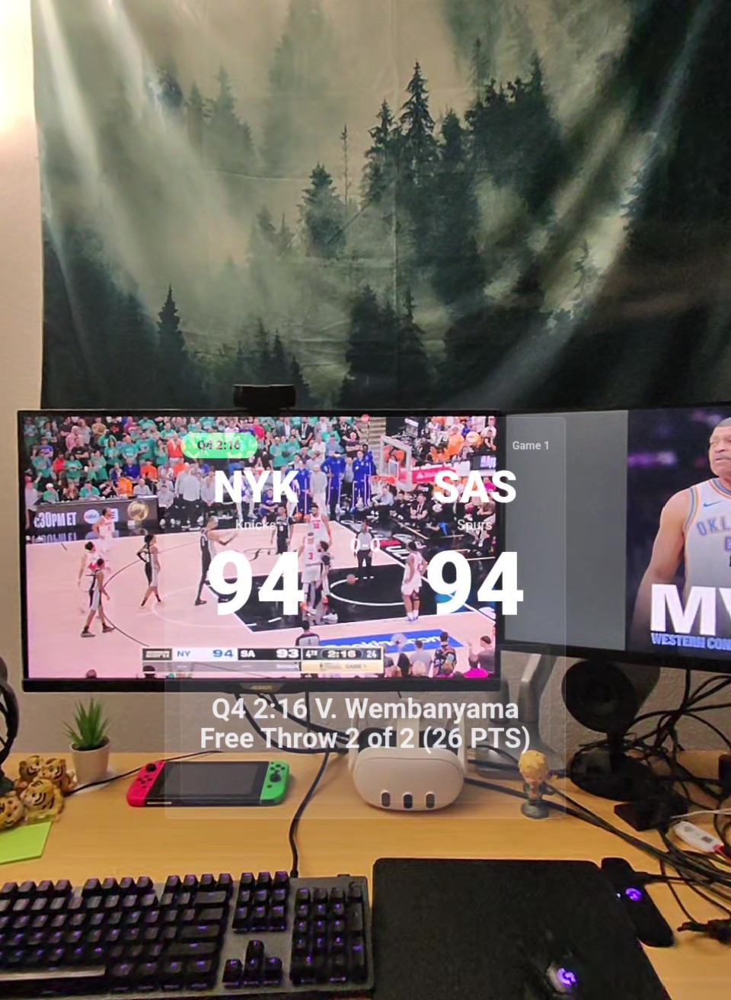

# Ball Knower - NBA live score and play-by-play for Meta Ray-Ban Display

<p align="center">
    
</p>

## Usage

Scan the QR code to add to Meta AI app:


### Controls

- D-pad up: show play-by-play
- D-pad down: hide play-by-play
- D-pad left: previous game
- D-pad right: next game
- Enter: refresh scores

### Manual setup

Open the Meta AI app.
1. Go to Devices > Display Glasses settings.
2. Open App connections > Web apps.
3. Add a web app named BallKnower.
4. Use https://nbaballknower.vercel.app/ as the URL.

## Local Development

Requires Python 3.10 or newer.

Create virtual environment:
```powershell
python -m venv .venv
```

Activate virtual environment:
```powershell
.\.venv\Scripts\Activate.ps1
```

Install dependencies:
```powershell
pip install -r requirements.txt
```

Run server:
```powershell
python src/server.py
```

Open `http://127.0.0.1:8000`.
